# Product Archetype and UX Architecture Report

Date: 2026-08-19
Plugin: `power-platform-skills/mobile-app` v0.3.0
Scope: product classification, experience planning, design materialization, screen generation, visual validation, editing, provenance, and regression tests

## Executive Summary

The mobile plugin previously conflated four different decisions:

1. Industry vocabulary
2. Product archetype
3. Workflow capabilities
4. Visual direction

That coupling caused the gym equipment app to be labeled `field inspection` because its requirements contained `scan`, `audit`, `inspection`, and `maintenance`. The primary repeated loop is instead asset lifecycle management:

`identify asset -> assess health -> schedule/perform maintenance -> resolve issue/repair -> verify return to service`

The correct product archetype is `asset-maintenance-cmms`. Inspection and QR scanning are supporting workflow capabilities. A CMMS may use utility, polished operational, premium brand-forward, editorial, immersive, playful, or reference-driven expression. Industry and workflow no longer select visual personality or Home composition.

The implemented v0.3 architecture introduces a canonical Product Experience contract, independent archetype/personality registries, deliberate Home compositions, binding screenshot/design intake, measurable first-viewport geometry, source-level validators, native runtime visual QA, edit/migration routing, template provenance, and cross-archetype regression fixtures.

## Gym App Classification

### Evidence

| Requirement signal | Product meaning |
|---|---|
| Multiple gyms and equipment assets | Managed asset estate and organizational scope |
| Preventive maintenance and next-service dates | Maintenance lifecycle |
| Issues, repairs, parts, downtime, and return to service | Corrective maintenance lifecycle |
| Warranty coverage | Asset ownership/lifecycle context |
| QR code lookup | Entry capability, not the product itself |
| Equipment audits and inspections | Assessment capability inside the lifecycle |

### Correct Contract

```yaml
industry_context: fitness-and-gym
product_archetype: asset-maintenance-cmms
workflow_capabilities:
  - qr-lookup
  - ordered-checklist
  - preventive-maintenance
  - issue-triage
  - repair-tracking
  - warranty-management
operating_context:
  - indoor-mobile-work
  - one-handed-phone
visual_personality: premium-brand-forward
visual_ambition: premium
content_emphasis: object-led
home_composition: asset-command
navigation_mood: atmospheric
density: comfortable
reference_fidelity: high
media_strategy: record-media
media_source: equipment image field with local asset fallback
```

A suitable first viewport is an `EquipmentCommandHero` occupying roughly 42% of the screen, with inspectable equipment media, identity/health, one integrated next action, at most two supporting metrics, and a visible hint of the next work section.

## Decision Ownership

| Dimension | Purpose | Owner | Approval |
|---|---|---|---|
| Industry context | Vocabulary and business constraints | Requirements planning | Gate 1 |
| Product archetype | Primary repeated user loop | Requirements planning | Gate 1 |
| Workflow capabilities | Behaviors/features | Architecture planning | Gate 2 |
| Operating context | Ergonomic constraints | Requirements planning | Gate 1 |
| Visual personality | Emotional/stylistic character | Experience planning | Gate 3 |
| Visual ambition | Template through bespoke depth | Experience planning | Gate 3 |
| Content emphasis | Image/object/data/relationship/task/timeline | Experience planning | Gate 3 |
| Home composition | Landing-screen structure | Screen planning | Gate 3 |
| Navigation mood/silhouette | Native chrome and route shape | Experience planning | Gate 3 |
| Media strategy/source/fallback | Real visual content and resilient states | Experience planning | Gate 3 |
| Reference fidelity | Structural relationship to supplied design | Design intake | Gate 3 |
| First Viewport Contract | Measurable dominant composition | Experience planning | Gate 3 |

No dimension may silently take ownership from another. In particular, industry cannot choose palette, typography, density, radius, personality, or Home composition.

## Product Archetype Registry

The canonical registry is in [product-archetypes.md](../shared/references/product-archetypes.md).

| Archetype | Primary repeated loop | Typical Home candidates |
|---|---|---|
| `asset-maintenance-cmms` | Asset health, maintenance, repair, return to service | asset command, queue first, timeline first |
| `field-inspection` | Assignment, ordered checks, evidence, sign-off | queue first, timeline first |
| `field-service-dispatch` | Accept, travel, service, labor/parts, close | queue first, timeline first |
| `facilities-operations` | Monitor sites, coordinate work, verify state | site/object command, queue first |
| `inventory-scan-first` | Scan, compare, count/move, resolve variance | scan command, queue first |
| `crm-relationship-workspace` | Understand relationship, act, update cadence | relationship command, personalized feed |
| `retail-catalog` | Discover, select, order, fulfill | media command, narrative Home |
| `healthcare-wellness` | Current care state, next task, progress, follow-up | object command, timeline first |
| `consumer-fitness` | Resume workout, train, record, recover | media/object command, personalized feed |
| `learning-coaching` | Resume, practice, feedback, progress | narrative Home, personalized feed |
| `finance-operations` | Understand balance/risk, review, approve/reconcile | data command, queue first |
| `scheduling-booking` | Find availability, book, manage, attend | timeline first, object command |
| `admin-operations` | Monitor/process/configure | operational dashboard, queue first |
| `custom` | Explicitly described loop not covered above | deliberately designed |

## Visual Personality Registry

The canonical registry is in [visual-personalities.md](../shared/references/visual-personalities.md).

- `utility`
- `polished-operational`
- `premium-brand-forward`
- `editorial`
- `immersive`
- `playful-consumer`
- `reference-driven`

Legacy `inspection`, `saas`, and `product` bundles remain token/component compatibility profiles. They no longer classify a product and are never selected from industry keywords.

## Home Composition Registry

Home no longer defaults to a dashboard. The canonical choices are in [home-compositions.md](../shared/references/home-compositions.md):

- `asset-command`
- `media-command`
- `object-command`
- `relationship-command`
- `data-command`
- `scan-command`
- `queue-first`
- `timeline-first`
- `narrative-home`
- `personalized-feed`
- `operational-dashboard`

`operational-dashboard` is valid only when comparing multiple metrics/queues is the real job. Every Home plan includes a signature component, viewport share, minimum height, media rule, headline minimum, metric maximum, action placement, next-section visibility, and duplicate-tab-action policy.

## Implemented Architecture

```mermaid
flowchart LR
  G1[Gate 1: requirements + product shape] --> P[Product Experience contract]
  P --> G2[Gate 2: complete architecture]
  G2 --> SP[Screen graph + specs]
  P --> SP
  SP --> G3[Gate 3: experience]
  G3 --> DS[Design-system materialization]
  DS --> SC[Signature/shared components]
  SC --> SB[Parallel screen builders]
  SB --> V[Plan + source validators]
  V --> M[Metro native app]
  M --> VQ[Visual QA screenshots + geometry]
  VQ --> R[Report/status]
```



### Canonical Contracts

- [product-experience-contract.md](../shared/references/product-experience-contract.md)
- [product-archetypes.md](../shared/references/product-archetypes.md)
- [visual-personalities.md](../shared/references/visual-personalities.md)
- [home-compositions.md](../shared/references/home-compositions.md)
- [reference-fidelity.md](../shared/references/reference-fidelity.md)

### Planning and Gates

- [four-gate-planning.md](../shared/references/four-gate-planning.md) assigns archetype/workflow to Gate 1/2 and visual composition/reference to Gate 3.
- [native-app-planner.md](../agents/native-app-planner.md) writes Product Experience, Design Direction, Design, and binding reference intake.
- [screen-planner.md](../agents/screen-planner.md) selects deliberate Home composition, first-viewport materialization, media fallback, and tab-root silhouettes.
- [create-mobile-app/SKILL.md](../skills/create-mobile-app/SKILL.md) carries the contract through both agent and inline paths without adding a fifth approval.

### Design Materialization

- [design-system/SKILL.md](../skills/design-system/SKILL.md) reads the full approved contract and always emits complete brand artifacts.
- [reference-intake.md](../skills/design-system/references/reference-intake.md) adds `--from-screenshot` and `--design-intake` structural extraction.
- [design-system-schema.md](../skills/design-system/references/design-system-schema.md) includes Product Experience link, composition, media, navigation, signature components, and provenance.
- [style-picker.md](../skills/design-system/references/vibe/style-picker.md) compares the same jobs/data through different compositions rather than token skins over one layout.

### Builder Enforcement

- [screen-builder.md](../agents/screen-builder.md) gives Product Experience/Reference Contract structural priority over materialization presets.
- The builder blocks when required signature components, media source/fallback, geometry, or design intake are absent.
- Step 10.8 generates signature components and repeated reference motifs before parallel builders run.
- `experience-*` test IDs expose non-visible runtime measurement anchors.

### Executable Validation

- [validate-experience-contract.js](../scripts/validate-experience-contract.js) validates enums, fields, ranges, media consistency, Design Direction drift, reference intake, Home specs, and tab silhouettes.
- [validate-screen-composition.js](../hooks/validate-screen-composition.js) checks signature component use, responsive height/share, headline minimum, metric limits, media/fallback, measurement IDs, duplicate tab actions, and repeated tab silhouettes.
- [validate-color-contrast.js](../hooks/validate-color-contrast.js) retains pattern checks and now resolves brand tokens for real WCAG ratio calculations.
- [mobile-validator-manifest.js](../scripts/lib/mobile-validator-manifest.js) registers plan and composition validators with the existing mobile changed-file dispatcher.

### Runtime Visual QA

- [visual-qa/SKILL.md](../skills/visual-qa/SKILL.md) owns native screenshot and rendered view-tree verification.
- Standard apps receive Home/tab smoke coverage.
- Premium/bespoke or high/strict-reference experiences require the full iOS/Android viewport matrix.
- Geometry is deterministic; perceptual/reference review is screenshot based.
- Exact pixel RMSE is not the primary metric.
- Missing native platform/viewport evidence is a concern/block, never a false pass.
- [debug-app/SKILL.md](../skills/debug-app/SKILL.md) remains terminal/runtime-error focused.

### Editing and Migration

- [edit-app/SKILL.md](../skills/edit-app/SKILL.md) distinguishes token-only refresh from Product Experience changes.
- Premium, reference matching, composition/media/navigation changes, and full redesigns update the plan, rebuild affected screens, and invoke visual QA.
- Legacy plans without Product Experience require an explicit migration before design/screen edits.

### Provenance and Status

- Template marker schema v2 records owner, plugin version, source, experience-contract version, and minimum compatible plugin.
- [check-template-provenance.js](../scripts/check-template-provenance.js) blocks mismatched fresh templates and permits documented legacy edit migration.
- [mobile-plan-status.js](../scripts/mobile-plan-status.js) schema v2 records archetype, personality, Home composition, reference fidelity, visual-QA result/report/coverage.
- [render-mobile-plan.js](../scripts/render-mobile-plan.js) renders structured safe Markdown and experience/QA cards instead of raw plan text in `<pre>`.

## Legacy App Migration

For an existing generated app:

1. Preserve the existing requirements and app code.
2. Classify the primary repeated loop against the archetype registry.
3. Move scan/inspection/approval/scheduling into workflow capabilities when supporting another loop.
4. Add `## Product Experience` with evidence and confidence.
5. Add First Viewport and Reference Contract fields.
6. Regenerate Design Direction and the full design-system artifact.
7. Re-plan Home and tab silhouettes without changing unrelated data architecture.
8. Generate required signature components before rebuilding affected screens.
9. Run experience, composition, contrast, TypeScript, route, and native visual-QA gates.
10. Add schema-v2 provenance only after migration passes.

The gym app's existing `Category: field inspection` should migrate to `Product archetype: asset-maintenance-cmms`; inspection remains a workflow capability.

## Regression Strategy

Cross-archetype fixtures cover:

- Premium CMMS with asset command
- Utility field inspection with queue first
- Polished CRM with relationship command
- Immersive retail with media command
- Playful scan-first inventory with scan command

Assertions verify registry membership, archetype/personality independence, Design Direction drift rejection, media requirements, Home materialization, source-level geometry, resolved contrast ratios, template provenance, renderer safety, and validator registration.

## Validation Evidence

- Merged source-branch Node suite: **187 passed, 0 failed, 0 skipped** on 2026-08-20.
- Cross-archetype Product Experience fixtures: CMMS, inspection, CRM, retail, and inventory combinations pass.
- Negative cases pass: Design Direction drift, first-viewport drift, missing media, invalid media command, and incomplete Home materialization are rejected.
- UX enforcement passes: source geometry/media/measurement IDs, resolved-token WCAG ratios, provenance, and validator registration.
- Corpus guards pass: no retired dashboard, split-gate, or industry-driven visual-fallback phrases; no nonzero letter-spacing values; valid report/reference links; aligned v0.3.0 metadata; and Expo/Microsoft Learn MCP registration.
- Visual-QA static evaluation: **10/10 criteria pass across 3 scenarios**.
- Native iOS/Android Expo MCP execution was not run against a migrated fixture in this session. `/visual-qa` correctly treats that missing runtime evidence as incomplete rather than a visual pass.

## Expected Outcome

Generated apps should now be correct on five separate axes:

1. Behavior matches workflow capabilities.
2. Product structure matches the primary repeated loop.
3. Visual expression matches an independently approved personality.
4. Supplied references constrain hierarchy and composition.
5. Native screenshots and rendered geometry prove the implementation.
