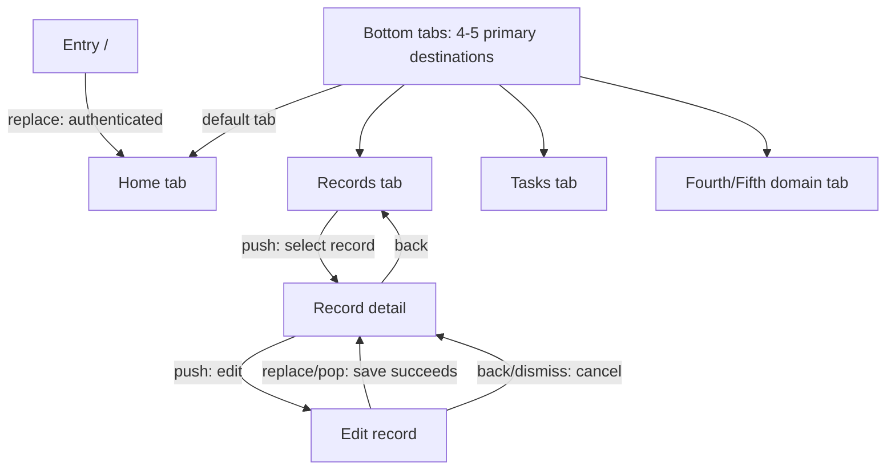
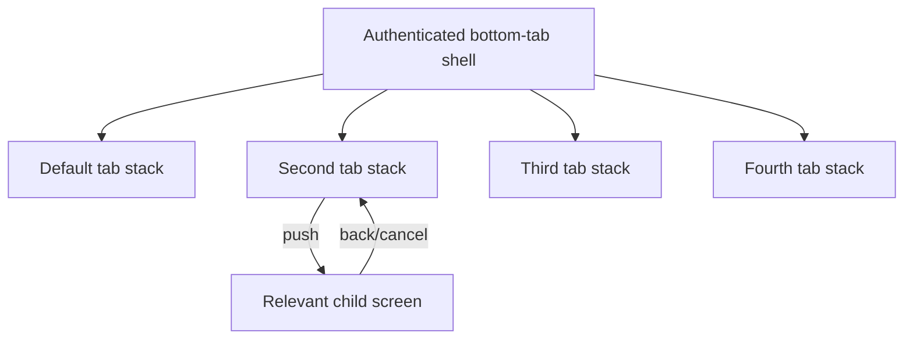

# Mobile App Plan

## Overview

- App name:
- Business problem:
- User context: authenticated accounts; backend-enforced authorization
- Success outcome:
- Target platforms:
- Supported locales/directions and content formats:
- Repeated-task density and input environment:
- Brand/media assets, rights, and attribution constraints:
- Data journey: mock baseline first; required Dataverse production integration in Stages 7-8

## Requirements

### In scope

### Constraints

### Assumptions

### Deferred

## Primary Workflow

Describe the trigger, steps, decisions, completion outcome, and exception paths.

## Requirements Screen Graph

The Plan stage owns this section. Define exactly four or five primary destinations in one authenticated bottom-tab shell, designate the default/home tab, and branch relevant detail/create/edit/workflow screens from their owning tab. Include every proposed screen and route. Label each edge as tab switch, push, replace, back, dismiss, or deep link and show deterministic back/cancel and direct-entry fallback paths. Include backend allowed/denied outcomes, modal/sheet routes, success/cancel paths, and meaningful empty/error branches. Do not model personas or client-side role branches. Detailed functionality and layouts belong to Screen Design.



### Screen Inventory

| Screen ID | Route | Typed route/search parameters | Navigation role / owning tab | User job | Information density | Primary action | Backend denial behavior | Entry paths | Exit + back/direct-entry fallback paths |
|---|---|---|---|---|---|---|---|---|---|

### Requirement Traceability

| Requirement / acceptance scenario ID | Screen IDs or system behavior | User-visible evidence | Integration dependency |
|---|---|---|---|

Before Plan completion, every in-scope requirement must map to a screen or be explicitly classified as non-UI/system behavior. Every screen must cite at least one defined requirement.

## Screen Design Specifications

The Screen Design stage owns this section. Establish a cohesive visual system, then repeat the composition and control specification for every planned Screen ID without changing scope silently. Navigation details are supporting context only; prioritize complete screen layouts, realistic content, rich task-appropriate controls, accessibility, and responsive transformations.

### Bottom Navigation Contract

| Tab order + Screen ID/route | Label + icon | Default | Selected/unselected/focus/pressed/badge states | Safe-area + keyboard behavior | Long-label behavior | Descendant stack + back/direct-entry fallback |
|---|---|---|---|---|---|---|

### Screen Navigation Graph

Screen Design restates the approved Requirements Screen Graph here as the build-facing Expo Router topology. Preserve all Screen IDs and routes; show the bottom-tab shell, each tab's descendant stack, presentation mode, and forward/back/cancel/deep-link fallback edges without adding scope.



### Visual Direction

| Aspect | Specification |
|---|---|
| Reference translation | Supplied references plus explicit `Adopt`, `Adapt`, and `Avoid` composition decisions |
| Product character | Domain-specific visual concept and one or two recurring motifs |
| Semantic color | Background, surfaces, text, borders, actions, focus, status, and data visualization roles plus dominant/contrast/accent proportions |
| Typography | Display, heading, title, body, label, caption, weights, line heights, and scaling behavior |
| Spacing and density | Token scale, content density, alignment rhythm, and readable maximum widths |
| Shape and depth | Radius, border, elevation/shadow, and overlay rules for one cross-platform visual system |
| Imagery and icons | Asset style, icon family, aspect ratios, loading/error fallback, and accessibility |
| Motion and feedback | Press, focus, progress, confirmation, transition, haptic, and reduced-motion behavior |
| Anti-generic constraints | Rejected card grids, repeated tile treatments, decorative effects, placeholder patterns, and other app-specific failure modes |

### Visual Token Contract

Define exact implementation inputs rather than descriptive color/type names alone. Use token names compatible with the existing Tamagui customization boundary and the `PowerAppsProvider` theme props.

| Token/role ID | Light value | Dark value | Usage and contrast requirement |
|---|---|---|---|
| | | | |

| Typography role ID | Font family/fallback | Weight | Size / line height | Scaling and usage |
|---|---|---|---|---|
| | | | | |

| Scale | Named values and intended use |
|---|---|
| Spacing | |
| Radius | |
| Border / elevation | |
| Icon sizes | |

#### Depth Roles

Use only this cross-platform hierarchy. Theme-token surfaces and borders must preserve separation where platform shadows are weak or increased contrast is active.

| Depth role | Tamagui elevation | Intended surfaces | Border/surface fallback | Theme and stacking checks |
|---|---|---|---|---|
| flat | `0` | Page sections, rows, grouped fields, banners, empty states | Divider or semantic border only when needed | No decorative lift |
| raised | `$1` | Selectable or repeated cards | Semantic border and contrasting surface | Clear in light/dark/increased contrast |
| floating | `$2` | Popovers, menus, detached fixed action docks | Semantic border and opaque surface | Above scrolling content; not clipped |
| modal | `$3` | Dialogs, sheets, drawers | Semantic border, opaque surface, overlay | Clearly above overlay and underlying content |

### Responsive Viewport Contract

Use the live Tamagui media keys. These are validation viewports and composition boundaries, not device-specific pixel positioning.

| Layout ID | Width/height/container constraint | Tamagui media key | Input modes and hinge/occlusion constraints | Expected composition behavior | Validation viewport |
|---|---|---|---|---|---|
| compact | | | | | |
| medium | | | | | |
| expanded | | | | | |

### Screen Contracts

Repeat this subsection for every Screen ID in the graph.

#### `<SCREEN-ID>` - `<Screen name>`

| Aspect | Requirement |
|---|---|
| Purpose and outcome | Business job and successful outcome |
| Traced requirements/scenarios | Stable requirement and acceptance-scenario IDs exercised by this screen |
| Information hierarchy | Focal point, scan order, progressive disclosure, and persistent versus scrolling content |
| Signature composition | One task-relevant memorable composition and why it improves hierarchy or efficiency |
| Realistic content | Domain copy, representative values, long/localized examples, and media |
| Authorization behavior | Backend-controlled operations and UI response to allowed or denied outcomes; no persona/role logic |
| Functionality | Search, filter, sort, scan, capture, review, edit, approve, submit, etc. |
| Primary / secondary actions | Labels, preconditions, result, and destination |
| Controls and components | Exact task-appropriate fields, selectors, lists, tables, charts, media, overlays, gestures, feedback, and contextual actions |
| Validation / business rules | Required values, conditional rules, limits, conflicts, and confirmations |
| Required states | Loading/skeleton, content, empty, error/retry, offline, denied, validation, submitting, selected, disabled, success |
| Accessibility | WCAG 2.2 AA readiness: labels/roles/values/states, focus order, keyboard/pointer, text and non-text contrast, dynamic/localized text, touch targets, announcement timing, single-pointer gesture alternatives, reduced motion, and authentication/input semantics |
| Route context | Stable route ID plus presentation/back/deep-link details only when they affect composition or prevent a dead end |

##### Visual Quality Gate

| Check | Evidence and revision |
|---|---|
| Thumbnail hierarchy | Focal point, section order, and primary action remain obvious at reduced scale |
| Grayscale hierarchy | Scale, spacing, and structure work without relying on color |
| Reference qualities | Adopted qualities are visible without copying reference content or branding |
| Composition originality | Screen does not collapse into equal cards, repeated tiles, or generic dashboard structure |
| Content realism | Long copy, representative values, imagery, and record density feel production-like |
| Persistent UI integration | Sticky actions/navigation respect safe areas and do not obscure or detach from content |
| Rendered refinement | At least two screenshot-based passes document issues found and corrected |

##### Layout Specification

| Aspect | Specification |
|---|---|
| Compact layout | Phone regions, hierarchy, scrolling, sticky controls, overlays, safe areas, and keyboard behavior |
| Medium layout | Wide phone/foldable regions, reflow, density, pane behavior, orientation, and split-screen constraints |
| Expanded layout | Tablet/web columns, master-detail panes, maximum widths, persistent tools, and information density |
| Component composition | Reusable and screen-specific components, required props, events, slots, and variants |
| Responsive rules | Named width/height/container constraints, compact-height/keyboard behavior, pointer/hover/focus modes, hinge/occlusion constraints, and how content reflows without overlap |
| Native-safe behavior | Host-platform constraints for controls, press feedback, overlays, system bars, safe areas, and keyboard behavior without separate iOS/Android designs |
| Screen shell and inset ownership | Shared shell contract plus the single top/bottom inset owner for native/hidden headers, scrolling or virtualized content, tabs, fixed docks, and keyboard-open state |
| HTML checkpoint | Representative screen/component/state anchors and compact mobile-width visual evidence in `.stages/02-screen-design.html` |

##### Screen State Matrix

Complete this matrix for every screen. Do not validate only the default content state. Mark a state `not applicable` only with a screen-specific reason.

| State ID / state | Required / not applicable | Acceptance + mock scenario IDs | Realistic content and hierarchy change | Controls and available actions | Feedback, focus, and announcement | Responsive impact | Recovery / next action | HTML state ID when represented |
|---|---|---|---|---|---|---|---|---|
| `<SCREEN-ID>-loading` / Loading / skeleton | | | | | | | | |
| `<SCREEN-ID>-content` / Content | | | | | | | | |
| `<SCREEN-ID>-empty` / Empty | | | | | | | | |
| `<SCREEN-ID>-error` / Recoverable error | | | | | | | | |
| `<SCREEN-ID>-offline` / Offline / unavailable | | | | | | | | |
| `<SCREEN-ID>-denied` / Backend denied | | | | | | | | |
| `<SCREEN-ID>-validation` / Validation | | | | | | | | |
| `<SCREEN-ID>-submitting` / Submitting / progress | | | | | | | | |
| `<SCREEN-ID>-success` / Success | | | | | | | | |
| `<SCREEN-ID>-interaction` / Disabled / selected / pressed / focus | | | | | | | | |
| `<SCREEN-ID>-overlay` / Overlay open | | | | | | | | |
| `<SCREEN-ID>-record-state` / Record-specific states | | | | | | | | |

##### Interaction Pattern Decisions

Evaluate each pattern for this screen and select it only when it improves the task. Repeated selected patterns become reusable component candidates.

| Pattern | Selected / not used | Task rationale | Behavior and states | Compact treatment | Medium/expanded treatment | Accessibility and fallback |
|---|---|---|---|---|---|---|
| Bottom sheet | | | | | | |
| Rich card or record row | | | | | | |
| Horizontal carousel | | | | | | |
| Smart search with suggestions | | | | | | |
| Recommendations | | | | | | |
| Skeleton loading | | | | | | |
| Swipe gesture | | | | | | |
| Floating/context-aware quick action | | | | | | |
| AI assistant panel | | | | | | |
| Progress indicator | | | | | | |
| Micro-animation | | | | | | |

##### Control Inventory

| Control / component ID | User intent | Tamagui or Expo primitive | Variants and states | Compact treatment | Medium/expanded treatment | Accessibility contract |
|---|---|---|---|---|---|---|

##### Form And Action Binding

Complete for every field, filter, selection, or command input. Use `Not applicable` only when the screen has no user input or repository command.

| Control ID | Domain field / type | Required and validation rules | Input purpose, keyboard, autofill/password-manager, and locale format | Repository operation.input | Success outcome | Domain error to UI state |
|---|---|---|---|---|---|---|

##### Data And Integration Contract

| Integration surface | Requirement |
|---|---|
| Domain reads | Entities and exact fields displayed/used |
| Domain writes | Entities and exact fields created/updated |
| Repository operations | Required queries, commands, filters, ordering, paging, and mutation outcomes |
| Mock source | Fixture/scenario and simulated latency/error behavior |
| Native capabilities | Capability, trigger, input/output, permissions, cancellation, fallback; or `Not required` |
| Non-Dataverse connectors | Connector, action/data, trigger, response fields, failure behavior, mock adapter; or `Not required` |
| Dataverse contract | Required tables, reads/writes, lookups/choices/files/images, ownership expectation, and generated interface consumers |
| Offline/cache | Cached data, draft behavior, freshness/sync expectation; or `Not required` |

### Component Map

Resolve every Stage 1 candidate before consolidating reusable contracts. Do not include one-off page hierarchy or section geometry. Classify framework-owned composition such as Expo Router `Tabs` as `framework primitive`, not as a Stage 3 component. Every `shared component` ID cited by a Screen Contract must appear exactly once here and name at least one required usage Screen ID.

| Component ID | Disposition + rationale | Implementation owner | Shared tier | Required usage Screen IDs | Shared anatomy + composed IDs | Typed variation props/events/slots | Variants/states | Token dependencies | Depth role | Accessibility/layout invariant | Preferred primitive or scaffold ID + screen-local remainder |
|---|---|---|---|---|---|---|---|---|---|---|---|

### Screen Shell And Inset Ownership Matrix

Use one row per screen and relevant context. Exactly one owner must claim each system-bar edge; use `none` only when the edge is intentionally not inset-protected.

| Screen ID | Context | Shell + scroll/list mode | Header / keyboard behavior | Top owner | Bottom owner | Left owner | Right owner | Max width/gutters + fixed footer spacing |
|---|---|---|---|---|---|---|---|---|

## Logical Data Model

```mermaid
erDiagram
```

### Entities

| Entity | Purpose | Ownership | Key fields | Relationships | Tier |
|---|---|---|---|---|---|

### Repository Contracts

| Repository | Intent-named operation | Typed input | Typed output | Ordering/paging/cache behavior | Domain errors | Consumer Screen IDs |
|---|---|---|---|---|---|---|

### Power Apps CLI Generation Manifest

| Data source | Connection or Dataverse table | Supported CLI add/generate command | Expected generated interfaces/services | Adapter consumer |
|---|---|---|---|---|

### Mock Scenarios

| Mock scenario ID | Trigger / operation input | Records and state | Result or domain error | Acceptance scenario IDs | Expected workflow outcome |
|---|---|---|---|---|---|

## Dataverse Schema Plan

| Entity | Reuse/extend/create | Proposed logical name | Notes |
|---|---|---|---|

> Deferred: this proposal does not authorize tenant mutation.

## Native Capabilities

| Capability | Workflow justification | Template package | Permission/fallback |
|---|---|---|---|

## Expo And Tamagui Experience

### Framework Capability Decisions

| User need | Shipped capability | Planned use | Platform/fallback | Validation level |
|---|---|---|---|---|

Record `Not used` with a reason for plausible capabilities that were evaluated but would add noise, risk, or no task value.

### Component System

| Component family | Tamagui primitive/composition | Variants and states | Responsive behavior | Accessibility contract |
|---|---|---|---|---|

### Shared Component Candidate Inventory

Stage 1 records candidates; Stage 2 resolves every row as promoted or screen-specific.

| Candidate ID | Screen IDs | Common anatomy and behavior | Stable semantic/accessibility/layout/platform boundary | Expected variation | Preferred scaffold ID or `custom` + fit/gaps/dependencies | Intended depth role | Stage 2 disposition and rationale |
|---|---|---|---|---|---|---|---|

### Media And Assets

| Asset/media ID | Source and representative content | Rights/license/replacement status | Attribution surface | Expo module | Loading/error/offline behavior | Size/aspect/crop/caching | Alternative, caption/transcript/audio-description contract |
|---|---|---|---|---|---|---|---|

### Localization

| Surface/content | Locale and formatting rules | Long/plural examples | Input/keyboard behavior | Validation evidence |
|---|---|---|---|---|

### Authentication And Sensitive Input Accessibility

| Surface/input | Input purpose and keyboard | Autofill/`autoComplete`/password-manager/paste | OTP/biometric/timeout/reauth behavior | Error/focus/announcement behavior | Accessible alternative |
|---|---|---|---|---|---|

### Motion And Feedback

| Interaction/state change | Animation or feedback | Purpose | Reduced-motion behavior |
|---|---|---|---|

### Accessibility Validation

| Surface/workflow | Applicable WCAG 2.2 AA criteria | Labels/roles/values/focus/live regions | Contrast/theme/text scaling | Touch/keyboard/pointer/screen reader | Locale/auth/media alternatives | Planned evidence |
|---|---|---|---|---|---|---|

### Performance And State

| Surface/workflow | List/media strategy | React Query/cache policy | Draft/local storage | Failure/rollback behavior |
|---|---|---|---|---|

### Experience Validation Matrix

| Capability or component family | Static/type-check | Web bundle/preview | Wrapped-device evidence (user-supplied) |
|---|---|---|---|

Stages 1-3 may populate only static/type-check evidence; Stage 2's standalone HTML checkpoint is design evidence, not an app preview. Schedule the first web bundle/complete-app preview only after App Builder has assembled all approved screens, workflows, providers, theme, typography, and icons. The workflow never launches iOS/Android simulators, dev clients, or native apps; native-only evidence is `not-run` unless separately supplied and confirmed by the user.

## Connectors

| Connector | Workflow justification | Data/actions | Mock behavior |
|---|---|---|---|

## Design Direction

- Brand inputs:
- Visual language:
- Typography:
- Palette:
- Density and layout:
- Motion:
- Imagery and assets:
- Tamagui theme/token strategy:
- Verified `PowerAppsProvider` inputs/ownership and app-owned contexts:
- Typography roles/font loading and fallback:
- Material Community Icon roles and accessibility:
- Expo platform adaptations:
- Accessibility:
- Explicit negatives:

## Delivery Waves

| Stage/wave | Maximum duration | Actionable output | Validation |
|---|---|---|---|

Required order: requirements, plan, screen design, component library, app builder, native capabilities, non-Dataverse connections, Dataverse schema, Dataverse adapters.

## Acceptance Scenarios

| Scenario ID | Given | When | Then | Requirement IDs | Screen/state IDs | Mock scenario IDs |
|---|---|---|---|---|---|---|

## Required Confirmations

| Gate | Status | Date | Notes |
|---|---|---|---|
| Connector/data-source mutation | pending | | |
| Dataverse schema mutation | pending | | |
| Destructive or external write | not required | | |
| Deployment | not requested | | |

## Review Gates

| Gate | Status | Review target | Resume condition |
|---|---|---|---|
| Post-App-Builder mock trial | pending | Web URL and one core workflow | User feedback received or user explicitly continues |

## Temporary Mock-Review Auth

- Status: inactive | active | restored
- Pre-preview auth state: empty | configured | not-captured
- Placeholder IDs written: yes | no
- Bypassed files:
- Restore trigger: before active data mode changes from `mock` to `dataverse`