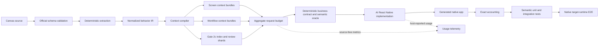

# Canvas-to-Native Modernization Hardening Plan

**Status:** Proposed  
**Scope:** `mobile-apps` Canvas/MSAPP modernization pipeline  
**Last updated:** 2026-07-15  
**Primary audience:** Mobile-app plugin maintainers, conversion-pipeline reviewers, agent authors, and release owners  
**Implementation state:** This document describes proposed work. Unless explicitly identified as current behavior, the contracts and artifacts below are not yet implemented.

## Related documents and implementation

- [Modernize Canvas App workflow](SKILL.md)
- [Canvas/MSAPP to Mobile Plugin handoff contract](../create-mobile-app/mobile-plugin-handoff-contract.md)
- [Create Mobile App orchestration](../create-mobile-app/SKILL.md)
- [Current screen-builder contract](../../agents/screen-builder.md)
- [Current workflow-builder contract](../../agents/workflow-builder.md)
- [Behavior-contract implementation](../../scripts/lib/behavior-contract.js)
- [Workflow Gate 2c summary projection](../../scripts/lib/workflow-gate-summary.js)
- [Migration-package validator](../../scripts/validate-mobile-plugin-input.js)
- [Current modernization tests](../../scripts/tests/msapp-conversion.test.cjs)
- [Current modernization evals](../../../../evals/mobile-apps/modernize-canvas-app/evals.json)
- [Shared telemetry architecture](../../../../shared/telemetry/README.md)
- [Microsoft Power Apps YAML documentation](https://learn.microsoft.com/power-apps/maker/canvas-apps/power-apps-yaml)
- [Official Power Apps YAML v3 schema](https://raw.githubusercontent.com/microsoft/PowerApps-Tooling/master/schemas/pa-yaml/v3.0/pa.schema.yaml)

---

## 1. Executive summary

The current modernization pipeline has a strong deterministic foundation:

- Source extraction and normalization do not call an LLM.
- Event actions are accounted without silent drops.
- Load-bearing behavior is separated from regenerable Canvas UI plumbing.
- Pathological event handlers are split into bounded workflow implementation shards.
- Screen builders receive per-screen behavior shards rather than the global behavior ledger.
- PCF and correctness-critical workflow choices require explicit user approval.
- Final deterministic gates check behavior, workflow, PCF, localization, assets, and visible conversion scaffolding.

The remaining scale problem is that a bounded behavior shard is not the same as a bounded model request. Screen and workflow agents can still receive large global companion artifacts, large always-loaded instruction files, plan context, generated-service metadata, and references. Gate 2c also presents all workflow reviews in one large summary. These patterns create repeated token cost and increase the chance that a model misses the most important evidence.

### 1.1 Product motto and ownership boundary

> **This is a new React Native app—not a Canvas transpilation. Preserve the business rules, Dataverse/data contract, connector and flow contract, and business logic. Let AI determine the best React Native implementation for everything else.**

This divides ownership deliberately:

| Owner | Responsibility |
|---|---|
| Deterministic modernization layer | Extract and preserve business rules, validation, authorization, calculations, data reads/writes, Dataverse tables/columns/relationships, connector/flow operations and arguments, workflow order/control flow, and explicit unsupported gaps |
| Power Apps target tooling | Discover target connections and generate typed models/services for Dataverse and other connectors |
| User approval gates | Resolve data-model changes, native capabilities, PCF replacement, correctness-critical transaction/retry/failure policy, target connectors, and the native screen graph |
| AI builders | Design and implement the new React Native component tree, hooks, state representation, navigation code, loading/error/empty UX, accessibility, reusable components, workflow code structure, and native equivalents |
| Deterministic validators and tests | Prove that AI implementation preserves the approved business/data/connector contract and surfaces every unsupported item |

The deterministic layer should produce contracts, constraints, typed target-service facts, and independent semantic oracles. It should not mechanically recreate Canvas UI choreography or preempt AI's choice of React Native architecture. AI has broad implementation freedom but no authority to change business meaning.

This plan changes the architecture from:

> Per-file size caps plus model-directed reading

into:

> Deterministic business-contract compilation plus aggregate budgets and progressive disclosure, followed by AI-native React Native implementation and independent semantic release evidence

The target flow is:



### Decisions proposed by this document

1. Build one deterministic context bundle per screen, workflow, and app-bootstrap task.
2. Budget the entire plugin-controlled model request, not individual files.
3. Replace the monolithic Gate 2c review summary with an index, decision shards, and workflow review shards.
4. Instrument context, model usage, retries, latency, and risk without emitting source content.
5. Reduce the screen-builder core contract and load task-specific references only when selected by the context compiler.
6. Compile normalized business/data/connector operations into exact contracts and semantic oracles, while leaving the React Native implementation to AI.
7. Validate current Canvas source against a pinned official schema and build a representative sanitized corpus.
8. Require semantic tests and native E2E evidence for release; marker coverage remains necessary but is no longer sufficient.

---

## 2. Motivation and measured baseline

### 2.1 TWEED benchmark

The current TWEED benchmark demonstrates that the deterministic contracts can represent a large application without dropping source events:

| Metric | Measured value |
|---|---:|
| Source controls accounted | 2,204 / 2,204 |
| Normalized behaviors | 3,007 |
| Exact core behaviors | 2,623 |
| Regenerable native-intent hints | 384 |
| Unmatched formulas retained for review | 108 |
| Screen behavior shards | 19 |
| Pathological workflows | 55 |
| Workflow steps | 468 |
| Correctness-critical workflow decisions | 33 |
| Dropped source event actions | 0 |
| Largest screen behavior shard | 420,847 bytes |
| Largest workflow implementation shard | 99,029 bytes |
| Gate 2c workflow summary | 345,744 bytes |
| Current screen-builder instructions | approximately 129,350 bytes |

The global artifacts that remain available around builder fan-out are significantly larger:

| Artifact class | TWEED size |
|---|---:|
| Global behavior ledger | approximately 10.8 MB |
| Behavior contract | approximately 5.7 MB |
| Global control-intent coverage | approximately 3.25 MB |
| Server-side asset/write guard | approximately 286 KB |
| Assets manifest | approximately 62 KB |
| Application-state report | approximately 45 KB |
| Components report | approximately 27 KB |

The global behavior ledger, behavior contract, and control coverage are already excluded from screen-builder prompts. The remaining global companions are smaller, but they are repeated across every screen and workflow invocation.

### 2.2 Why the current 512 KiB limit is insufficient

The existing limit protects each screen shard, workflow shard, and Gate summary independently. It does not account for:

- Agent instructions
- Conditional references
- The task prompt
- Plan sections
- Typed skeleton code
- Global state/write/component/asset/localization companions
- Generated-service contracts
- Tool results and repair context
- Output-token headroom

A 420 KB JSON shard can itself represent roughly 100K or more model tokens depending on tokenizer and content. Adding the current 129 KB screen-builder contract and global companions can produce a request much larger than the shard cap suggests.

### 2.3 Correctness limitation of marker coverage

Current source markers provide traceability. They establish that generated code claims ownership of a source behavior, intent, workflow step, or PCF disposition. They do not prove that:

- The right field was written
- The right service method was called
- The right route parameter was passed
- Alternative branches remain exclusive
- Partial failure follows the approved policy
- Connector failures are surfaced correctly
- The native runtime actually contains the required module

This plan preserves marker coverage but adds source-derived semantic test oracles and target-runtime verification.

---

## 3. Goals and non-goals

### 3.1 Goals

- Reduce repeated model context without dropping source semantics.
- Make every model request auditable before invocation.
- Fail before model invocation when required context exceeds budget.
- Keep exact source behavior separate from native UX judgment.
- Use deterministic generation wherever source semantics and target APIs are sufficiently typed.
- Preserve existing user approval boundaries for data, native capabilities, PCF, workflows, connectors, and screens.
- Measure actual usage when the host exposes it, and report unavailability honestly otherwise.
- Validate structural compatibility with the official versioned Canvas source schema.
- Establish release confidence across representative apps rather than one large benchmark.
- Require semantic evidence for writes, connectors, workflow failure paths, and native runtime behavior.

### 3.2 Non-goals

- Pixel-perfect reproduction of Canvas coordinates or control chrome.
- Executing raw Power Fx in the target app.
- Hosting Canvas PCF binaries inside the native runtime.
- Reusing source connection, flow, environment, or workflow GUIDs.
- Sending source code or source identifiers through telemetry.
- Calling a separate model API solely to obtain token counts when the agent host owns invocation.
- Automatically converting formulas whose semantics cannot be proven.
- Treating a schema-valid Canvas app as semantically complete.
- Using model-generated tests as the sole oracle for model-generated implementation.

---

## 4. Design principles

### 4.1 Deterministic scope ownership

The deterministic compiler decides what a task may read. An agent must not search global migration artifacts to discover missing context.

### 4.2 Conservative inclusion

When dependency evidence is ambiguous, include the dependency and raise task risk. Do not omit it merely to satisfy a budget.

### 4.3 Exact behavior is never truncated

Optional examples and reference prose can be removed or split. Exact core behavior cannot be truncated, summarized away, or silently demoted.

### 4.4 Separate review evidence from implementation evidence

Human/model review artifacts must contain enough information to approve a decision without carrying raw formulas and full payloads. Exact implementation artifacts remain private to the responsible builder.

### 4.5 Token budget and cost budget are distinct

All tokens count toward the context window, including cache reads. Billing weights uncached input, cache creation, cache reads, and output differently. Both views must be retained.

### 4.6 Telemetry is allowlist-only

No event may carry arbitrary strings from source artifacts. Local diagnostics and remote telemetry must use the same source-free event schema.

### 4.7 Tests derive from source contracts

Expected behavior must come from deterministic source IR and approved policy, not from assumptions embedded in generated implementation.

### 4.8 Verification ownership

Acceptance criteria in this document are verified through four explicit owners:

| Verification owner | Responsibilities |
|---|---|
| Deterministic package/runtime validators | Artifact schemas, exact unions, hashes, budgets, path safety, approval state, and generated-code invariants |
| Automated unit, integration, corpus, and semantic tests | Selection algorithms, business-contract projections, failure branches, connector/write semantics, and regression coverage |
| Pull-request review | Architecture boundaries, privacy allowlists, third-party dependency/license changes, and documented compatibility decisions |
| Release owner with target-platform automation | Environment-dependent connector checks, Android/iOS target-runtime E2E, telemetry provisioning, and final release evidence |

Every implementation PR must identify which owner verifies each newly introduced invariant. Manual review cannot substitute for an automatable exact-accounting or safety check.

---

## 5. Workstream 1 — Per-task filtered context bundles

### 5.1 Problem

Screen builders currently receive one per-screen behavior shard but may also receive complete application-level component, state, server-side asset, localization, and asset artifacts. Workflow builders receive private implementation shards but also global state and write guards.

This causes:

- Repeated token cost
- Unrelated identifiers competing for attention
- Higher prompt-injection surface from source-derived strings
- Harder budget accounting
- Ambiguity about which companion facts are authoritative for the task

### 5.2 Proposed artifacts

Introduce a versioned `agent-context-bundle-v1` contract with separate screen, workflow, and app-bootstrap variants.

Suggested package layout:

```text
context-bundles/
  source/
    screens/<screen-artifact>.json
    workflows/<workflow-id>.json
    app.json
  build/
    screens/<screen-artifact>.json
    workflows/<workflow-id>.json
    app.json
  index.json
```

The source bundle is created during deterministic adaptation. It contains only source-derived facts and does not claim target generated-service availability.

The build bundle is regenerated after target data sources, native capabilities, PCF decisions, workflow decisions, generated services, route skeletons, and shared components are ready. It adds exact target imports, model/service names, method availability, and approved target strategies.

### 5.3 Proposed schema

```json
{
  "$schema": "agent-context-bundle-v1",
  "generatedAt": "1970-01-01T00:00:00.000Z",
  "task": {
    "kind": "screen",
    "ownerId": "screen-<stable-hash>",
    "riskLevel": "medium",
    "targetFile": "app/(app)/orders.tsx"
  },
  "screenContract": {
    "route": "/(app)/orders",
    "archetype": "list",
    "navigation": {},
    "design": {}
  },
  "behavior": {
    "shardSchema": "behavior-shard-v2",
    "core": [],
    "intentHints": [],
    "workflowRefs": [],
    "controlIntents": [],
    "unmatched": []
  },
  "state": [],
  "writeContracts": [],
  "assets": [],
  "localization": [],
  "components": [],
  "generatedServices": [],
  "referenceSelectors": [],
  "unresolved": [],
  "budget": {
    "countMethod": "estimated",
    "controlledInputTokens": 0,
    "limitTokens": 0,
    "headroomTokens": 0,
    "chunks": []
  },
  "provenance": {
    "inputs": []
  }
}
```

Artifact `$schema` values in this migration contract are stable local identifiers such as `agent-context-bundle-v1`, matching the repository's existing artifact convention. They are not URLs. The separately pinned Microsoft Canvas schema retains its official URL-valued `$id`/`$schema` metadata. Task risk is assigned using Appendix B and may be recalibrated only through a versioned policy change.

### 5.4 Screen-bundle selection algorithm

#### Step 1 — Establish owned behavior

Read the screen's behavior shard and collect:

- Exact core behavior IDs
- Native-intent hint IDs
- Unmatched review rows
- Control-intent rows
- Workflow call references
- Approved PCF projections

#### Step 2 — Compute state closure

For every owned behavior:

1. Collect `stateReads[]` and `stateWrites[]` from the behavior contract.
2. Include the writer closure for state read by exact core behavior.
3. Include state required by unmatched formulas.
4. Include cross-screen state only if this screen reads or writes it.
5. Preserve the recommended target placement for each selected key.
6. Mark uncertain state dependencies as `high` risk rather than omitting them.

The resulting state section contains only selected entries, not the complete application report.

#### Step 3 — Select writable columns

Collect columns from:

- `Patch`, `Update`, `UpdateIf`, create, delete, and form-submit operations
- Form field mappings
- Workflow call inputs or outputs owned by this screen
- Lookup bindings
- Primary IDs required for create-then-navigate or child creation

Then intersect with target model metadata and subtract:

- Calculated columns
- Rollup columns
- Virtual columns
- Audit columns
- Ownership columns
- Status/state fields that require dedicated operations
- Other server-managed fields

If target generated models do not contain a required source column, record an unresolved schema requirement and block the affected write rather than inventing a cast.

#### Step 4 — Select assets

Include an asset only when:

- A control on this screen references it
- An owned behavior references it
- An instantiated component on this screen references it
- An approved native replacement requires it

Manifest-only assets with no bytes remain explicit follow-ups and may not produce a broken `require()`.

#### Step 5 — Select localization

Include only:

- Keys rendered by this screen
- Keys used by selected component instances
- Keys used by workflow result/error UX at this call site

If no authoritative key exists, include literal fallback text and prohibit invented translation keys.

#### Step 6 — Select components

Include only component definitions instantiated on the screen, with:

- Typed inputs
- Output reads
- Event/callback bindings
- Semantic role
- Exact instance bindings
- Approved native disposition

A definition with no source instance is excluded. Proven-empty disposable Canvas scaffolding is represented as removal guidance rather than a runtime component.

#### Step 7 — Select generated services

Resolve from selected behaviors, data bindings, workflow references, and screen contracts:

- Exact service import path
- Exact model import path
- Available methods
- Relevant method input/result shapes
- Selected table/connector/flow identity in the target environment
- Lookup entity-set requirements

Do not include unrelated generated services.

#### Step 8 — Select references

Emit explicit selectors such as:

```text
archetype:list
navigation:router-contract
modernization:canvas-behavior
modernization:pcf
service:dataverse-read
service:dataverse-write
capability:barcode
quality:accessibility
```

The builder may read only the modules selected by this list.

### 5.5 Workflow-bundle selection algorithm

A workflow bundle begins from exactly one private implementation shard.

Include:

- One workflow's exact core actions and native-intent hints
- Approved decisions and execution owner
- Named-step and control-flow contracts
- Only state read or written by those actions
- Only writable columns touched by those steps
- Only generated services invoked by those steps
- Only user-facing localization needed for typed results/errors
- Only the selected write guard

Exclude:

- Other workflow plans or implementation shards
- Screen visual design
- Unrelated assets/components
- Global behavior and control ledgers

### 5.6 Provenance and drift protection

Every bundle input should include:

- Relative artifact kind
- Schema version
- SHA-256 digest
- Selection reason
- Required/optional status

Build-bundle validation fails when any authoritative input changes after bundle materialization. Bundles are regenerated; they are never manually patched.

### 5.7 Failure policy

- Missing optional presentation evidence becomes a concern.
- Missing exact behavior, state dependency, write contract, route, generated service, workflow module, or approved PCF strategy is blocking.
- Over-budget exact evidence is not dropped. The task must be split at a deterministic boundary or blocked.

### 5.8 Acceptance criteria

- A screen bundle contains no unrelated state, columns, assets, localization, components, or generated services.
- Every included entry has a deterministic selection reason.
- The union of builder/workflow/app bundle behavior ownership matches the global contract exactly.
- Rebuilding identical inputs produces byte-identical artifacts.
- Builders no longer receive separate global adapted companion paths.
- Stale bundle hashes block agent fan-out.

### 5.9 Required tests

- State dependency closure across screens
- State dependency closure from unmatched formulas
- Exact write-column selection and read-only exclusion
- Per-screen asset and localization filtering
- Component instance/event filtering
- Generated-service filtering
- Ambiguous dependency promotion to high risk
- Stable output under shuffled input order
- Drift rejection after source or generated-service changes
- No cross-bundle behavior duplication

---

## 6. Workstream 2 — Aggregate token and context budgeting

### 6.1 Problem

Per-file byte caps cannot answer whether the complete model invocation is safe or affordable. The aggregate request includes stable instructions, selected references, volatile task context, skeleton code, and tool results.

### 6.2 Budget definitions

For a task:

```text
controlled input =
  agent core
  + selected references
  + task prompt
  + context bundle
  + plan/design slice
  + typed skeleton
  + generated-service contracts
```

In mathematical form:

```text
T_controlled = T_core + T_refs + T_prompt + T_bundle + T_plan + T_skeleton + T_services
```

The preflight condition is:

```text
T_controlled + T_reserved <= T_task_limit
```

`T_reserved` covers host/system overhead that the plugin cannot inspect, output, tool results, and repair turns.

### 6.3 Two budget views

#### Context-window budget

Counts every input token, including cache reads, because cached content still occupies model context.

#### Cost budget

Tracks token categories separately:

- Uncached input
- Cache creation
- Cache read
- Output

Currency cost should be calculated downstream from a versioned pricing table. The plugin must not embed a stale dollar estimate in skill instructions.

### 6.4 Counting modes

`countMethod` must be one of:

- `host-reported` — exact metadata returned by the agent host
- `provider-count` — exact count from a host-provided counting operation
- `estimated` — conservative deterministic estimate
- `unavailable` — no trustworthy token count; bytes remain available

The plugin currently does not own model API calls. It must not send customer context through a second provider request merely to count tokens.

When exact counting is unavailable:

- Use a conservative estimator calibrated on JSON, Markdown, and TypeScript.
- Maintain a strict byte ceiling as defense in depth.
- Apply an additional safety multiplier.
- Never report estimates as actual usage.

### 6.5 Budget manifest

Each request manifest records every plugin-controlled chunk:

```json
{
  "kind": "screen-builder",
  "riskLevel": "medium",
  "countMethod": "estimated",
  "limitTokens": 64000,
  "headroomTokens": 16000,
  "chunks": [
    {
      "kind": "agent-core",
      "required": true,
      "bytes": 18000,
      "estimatedTokens": 6000,
      "sha256": "..."
    },
    {
      "kind": "context-bundle",
      "required": true,
      "bytes": 82000,
      "estimatedTokens": 26000,
      "sha256": "..."
    }
  ]
}
```

Do not include file paths, screen names, or source identifiers in telemetry derived from this manifest. The local package may retain relative paths for diagnostics.

### 6.6 Initial budget profiles

Initial values require calibration. Suggested starting targets are:

| Task | Controlled-input target | Suggested reserved headroom |
|---|---:|---:|
| Gate 2c index | 4K–8K tokens | 4K |
| One correctness decision | 2K–4K | 2K |
| One workflow review | 4K–8K | 4K |
| Workflow implementation | 32K–48K | 12K–16K |
| Low-risk screen | 40K–48K | 12K–16K |
| Medium-risk screen | 48K–64K | 16K |
| High-risk screen | 64K–96K | 20K–24K |

These are cost/attention targets, not claims about the provider's maximum context window.

### 6.7 Over-budget reduction order

The compiler may reduce context only in this order:

1. Remove optional examples.
2. Remove unselected references.
3. Replace verbose plan prose with typed fields.
4. Filter companions more precisely.
5. Use generated-service signature slices rather than whole files.
6. Split independently testable components or workflow phases only when every resulting task fits its own complete aggregate budget, exact behavior ownership remains 100% across the union, and each part has an independently executable Tier 2-or-higher semantic oracle. A split must not turn one incomplete task into multiple partial implementations.
7. Block with an itemized budget report.

It may never:

- Drop exact core behavior
- Drop unmatched statements
- Drop selected write fields
- Drop required state dependencies
- Summarize away approved workflow policy
- Truncate a file without recording the omission

### 6.8 Runtime accounting

After a task completes, record:

- Preflight controlled bytes/tokens
- Host-reported input/output/cache usage when available
- Difference between estimate and actual
- Retry count
- Added repair context
- Final duration and outcome

This data calibrates future profiles.

### 6.9 Acceptance criteria

- Every model task has one aggregate request manifest.
- Every plugin-controlled chunk is accounted exactly once.
- Budget checks run before task dispatch.
- Exact evidence cannot be removed to meet budget.
- Context and cost budgets remain separate.
- Estimated and actual token values are never conflated.
- Hidden host overhead is covered by explicit headroom.

---

## 7. Workstream 3 — Split Gate 2c review artifacts

### 7.1 Problem

The current `workflow-gate-summary-v1` projection carries all workflows, all named steps, all correctness questions, and all approval states in one model-facing file. TWEED produces approximately 346 KB for 55 workflows.

Although exact formulas are excluded, the aggregate review is still too large and forces unrelated workflows into the same review context.

### 7.2 Proposed artifact layout

```text
workflow-review/
  index.json
  decisions/
    <decision-id>.json
  workflows/
    <workflow-id>.json
  report.html
```

Exact implementation remains in the existing private workflow implementation shards.

### 7.3 Gate index contract

`workflow-review-index-v1` contains:

- Source plan schema/digest
- Aggregate statistics
- Workflow ID
- Owning screen/event stable labels for local display
- Risk level
- Step count
- Core/regenerable counts
- Unmatched count
- Decision count
- Unresolved decision count
- Approval state
- Review-shard reference and digest
- Implementation-shard reference and digest

It contains no formulas, payloads, field maps, or full control-flow frames.

### 7.4 Decision shard contract

`workflow-decision-review-v1` contains one question:

- Decision ID
- Decision type
- Workflow ID
- Human-readable question
- Why source evidence is insufficient
- Allowed option values
- Human labels
- Effect of each option
- Recommended value and rationale
- Whether a server dependency is required
- Current resolution, including the fixed resolver role (`user`, never an identity), ISO-8601 resolution time, selected value, and approval-required state

The decision shard must not include raw formulas or source payloads.

### 7.5 Workflow review shard contract

`workflow-review-v1` contains:

- Source owner and event
- Deterministic complexity score and reasons
- Compact ordered step summaries
- Control-flow kinds, not full frames
- Target module/export/call-site summary
- Execution owner
- UX mode
- Resolved policy summary
- Approval status
- Implementation-shard digest

### 7.6 Gate flow

1. Read the small index.
2. Enumerate unresolved decision shards.
3. Ask each deterministic question directly with its defined options.
4. Persist resolutions into authoritative `workflows.json`.
5. Atomically regenerate the affected decision shard, workflow review shard, index, and local report.
6. Validate no drift.
7. Present workflow reviews in bounded pages or batches.
8. Let the user inspect the complete expandable local HTML report.
9. Request one final approval for the complete plan.
10. Run strict approval validation before workflow builders start.

### 7.7 Why a local report is important

A human must be able to inspect all 55 or more workflows without requiring one model turn to ingest every detail. The report should:

- Load the index immediately
- Expand per-workflow summaries on demand
- Show unresolved and blocked items first
- Display policy choices and effects
- Never execute source content
- Remain self-contained and local

### 7.8 Synchronization and import behavior

- `workflows.json` remains authoritative.
- Review artifacts are deterministic projections.
- Incoming approvals and answers are reset during safe import as today.
- A synchronizer regenerates all affected projections atomically.
- `--check` mode compares expected and existing artifacts without mutation.
- Validation rejects missing, extra, stale, duplicate, or over-budget review shards.

### 7.9 Acceptance criteria

- Gate 2c never requires reading the full workflow catalog into one model context.
- Every required decision appears exactly once.
- Every workflow has exactly one review shard and implementation shard.
- Review artifacts contain no raw formulas or exact payloads.
- The user can inspect the full plan and still provide one final approval.
- Approval reset and blocker behavior remain unchanged.

---

## 8. Workstream 4 — Privacy-safe usage instrumentation

### 8.1 Objectives

Measure:

- Model actually selected by the host
- Input, output, cache-read, and cache-create tokens when exposed
- Plugin-controlled context bytes
- Token count method
- Retry count
- Latency
- Task role
- Screen/workflow risk level
- Budget utilization
- Outcome and coarse failure class

Never emit source content.

### 8.2 Host limitation

The mobile plugin does not directly call a model API. Agent hosts may or may not expose usage metadata to plugins or task orchestrators.

Therefore:

- Host-reported usage is authoritative when present.
- Context bytes are always measurable.
- Estimated tokens remain explicitly estimated.
- Cache usage is absent when the host does not expose it.
- The implementation must not scrape conversation transcripts.
- The implementation must not issue a second provider request solely for token counting.

### 8.3 Proposed events

| Event | Timing | Purpose |
|---|---|---|
| `modernizer_context_compiled` | After bundle/budget preflight | Context size, selected reference count, risk, budget result |
| `modernizer_task_started` | Immediately before task dispatch | Task role, risk, attempt number, model requested |
| `modernizer_task_completed` | After return or failure | Outcome, duration, actual usage when available, retries |
| `modernizer_gate_completed` | After Gate 2b/2c/3/4 | Coarse gate type, decision-count bucket, outcome |
| `modernizer_release_check_completed` | After semantic/release checks | Check tier, pass/fail, duration |

### 8.4 Allowed event fields

Suggested allowlist:

- `agentRole`
- `riskLevel`
- `modelId`
- `usageSource`
- `contextBytes`
- `estimatedInputTokens`
- `inputTokens`
- `outputTokens`
- `cacheReadInputTokens`
- `cacheCreateInputTokens`
- `budgetTokens`
- `budgetUtilizationBucket`
- `retryCount`
- `durationMs`
- `outcome`
- `failureClass`
- `bundleSchemaVersion`
- `screenCountBucket`
- `behaviorCountBucket`
- `workflowCountBucket`
- `deterministicCoverageBucket`

Use buckets rather than exact app-scale counts where exact combinations could fingerprint a customer application.

### 8.5 Forbidden event fields

Never send or persist in the local telemetry mirror:

- Prompt/response text
- Power Fx
- TypeScript source
- Screen/control/component names
- Workflow or behavior IDs
- Table/column/service names
- File paths
- App/environment/connection/flow IDs
- Source hashes
- Asset names
- Localization keys or values
- User-entered approval reasons
- Stack traces
- Error messages
- Customer records

### 8.6 Local run ledger versus remote telemetry

The initial implementation is **local-only**: the migration workspace may contain a source-free operational run ledger for debugging and calibration, but it does not transmit model-task events. Remote transmission is a separate, later release decision. If approved, it may reuse the shared telemetry architecture only after:

- A mobile-plugin-specific instrumentation key is provisioned
- A mobile-plugin-specific event stream is provisioned
- Field mappings are deployed
- Opt-out behavior is documented
- CI transmission opt-out is set
- Source-content adversarial tests pass

Never copy the Power Pages instrumentation key, event stream, or region resolver.

### 8.7 Cost calculation

Do not transmit a dollar estimate. Calculate cost downstream using:

- Model ID
- Uncached input tokens
- Cache creation tokens
- Cache read tokens
- Output tokens
- Versioned pricing effective date

This avoids stale costs and supports multiple hosts/providers.

### 8.8 Reliability posture

- Telemetry emission is fire-and-forget.
- Telemetry failures never change conversion outcome.
- Unavailable usage metadata is not a failure.
- Invalid field types are dropped by the allowlist.
- Source-like strings supplied to telemetry builders are rejected in tests.

### 8.9 Acceptance criteria

- Context bytes, retries, duration, risk, and outcome are available for every dispatched task.
- Token/cache fields are populated only from trustworthy host metadata.
- No source-derived text reaches local or remote telemetry.
- CI cannot transmit production events.
- Telemetry code cannot change a skill/script exit code.

---

## 9. Workstream 5 — Progressive screen-builder contract

### 9.1 Current size profile

Approximate current section sizes:

| Section | Bytes |
|---|---:|
| Preamble | 1,546 |
| Hard rules | 59,996 |
| Workflow overview | 174 |
| Read spec | 6,373 |
| Design direction | 1,569 |
| Brand system | 1,830 |
| Design-to-code translation | 7,971 |
| Inspect services | 1,828 |
| Translate behavior | 3,076 |
| Tamagui config | 3,556 |
| Write screen | 39,142 |
| Return status | 2,290 |

Hard rules and screen-writing guidance account for roughly 77% of the current approximately 129 KB contract.

### 9.2 Target core contract

Target approximately 10–20 KB containing only always-applicable rules:

- Single-screen ownership
- Return protocol
- Source trust boundary
- Context-bundle contract
- Exact behavior/PCF/workflow accounting
- Generated-services-only data access
- Assigned-file-only write scope
- No raw Power Fx execution
- Blocking versus concern rules
- Minimal quality checklist

### 9.3 Conditional reference modules

Suggested modular groups:

| Module selector | Content |
|---|---|
| `archetype:list` | Virtualized lists, pagination, search/filter, row actions |
| `archetype:detail` | Single-record loading, sections, related records |
| `archetype:form` | React Hook Form, validation, create/update, dirty state |
| `archetype:dashboard` | KPIs, summaries, empty/error states |
| `archetype:calendar` | Calendar/timeline-specific contracts |
| `navigation:router-contract` | Route params, push/navigate/replace, tap idempotency |
| `service:dataverse-read` | Operation results, selects, formatted values, lookups |
| `service:dataverse-write` | Narrow payloads, lookup binds, generated IDs |
| `service:connector-flow` | Generated connector/flow services and failure handling |
| `modernization:canvas-behavior` | Core behavior, intent hints, source markers |
| `modernization:workflow-call` | Shared workflow invocation and progress UX |
| `modernization:pcf` | Approved PCF projection and implementation markers |
| `capability:camera-barcode` | Camera and barcode primitives |
| `capability:files-images` | File/image host controls and native pickers |
| `capability:pdf-pen-location` | Relevant allowlisted native capabilities |
| `quality:brand` | Tokens, visual hierarchy, design negatives |
| `quality:accessibility` | Touch targets, labels, focus, contrast |

The context compiler, not the model, selects modules.

Selectors compose as an additive set:

- Include every matching selector; a list screen that also edits inline may select both `archetype:list` and `archetype:form`.
- Archetype selectors do not override data, navigation, capability, modernization, or quality selectors.
- Select read and write references independently. A read-only list omits `service:dataverse-write`; a screen that reads and writes selects both.
- Selector dependencies are declared in the checked-in selector manifest. For example, `modernization:workflow-call` may require `modernization:canvas-behavior`, but an agent may not infer or add that dependency itself.
- Mutually incompatible selectors are a context-compilation error rather than a precedence decision delegated to the model.

### 9.4 Rules to move out of prose

Mechanical rules should live primarily in deterministic hooks/checkers:

- Direct HTTP prohibition
- Generated-service import validation
- Dataverse payload safety
- Server-managed field rejection
- Route contract validation
- Unsupported icon imports
- Runtime-banned packages
- Heavy-list query/N+1 checks
- Color contrast
- Accessibility labels and touch targets
- Visible conversion scaffolding

The core contract states the invariant and instructs the builder to repair diagnostics; it does not repeat every parser pattern and example.

### 9.5 Stable-prefix ordering

When the host supports prompt caching, request assembly should order content as:

1. Stable core contract
2. Stable selected references
3. Volatile bundle
4. Volatile skeleton and repair context

Cache effectiveness must be measured through host-reported cache usage rather than assumed.

### 9.6 Migration strategy

1. Extract current rules into an inventory.
2. Classify each rule as core, conditional, or deterministic-check-only.
3. Build selector tests mapping bundle features to required modules.
4. Run current screen evals against old and modular contracts.
5. Compare compile, runtime, accessibility, behavior, retry, and token outcomes.
6. Remove duplicated prose only after equivalent enforcement exists.

### 9.7 Acceptance criteria

- Core screen-builder instructions are at or below 20 KB.
- Low-risk screens, as defined in Appendix B, load only relevant modules.
- No hard rule disappears without deterministic or conditional replacement.
- Existing compile/write/route/a11y/runtime guards do not regress.
- Median plugin-controlled input decreases materially on the corpus.

---

## 10. Workstream 6 — Deterministic business contract, AI-owned React Native implementation

### 10.1 North star

The extractor already normalizes Power Fx actions and declarative formulas. That normalization is valuable because it captures business meaning, not because it should become a mechanical TypeScript transpiler.

The target is a new React Native product. AI should choose idiomatic React Native architecture and UX. The deterministic layer constrains what must remain true:

- Business rules and calculations
- Validation and authorization obligations
- Dataverse data model and exact read/write fields
- Connector and flow operations, arguments, and expected results
- Workflow order, branches, loops, concurrency, and approved failure policy
- Explicit unsupported behavior

### 10.2 Proposed business-contract IR

Introduce `business-contract-ir-v1` as the typed representation between source normalization and AI implementation/testing.

Each contract entry records:

- Stable source behavior ID
- Owning screen, workflow, or app-bootstrap task
- Business intent kind
- Ordered control-flow frames
- State reads and writes
- Dataverse table, field map, lookup, and read/write intent
- Connector/flow operation and typed argument contract
- Validation, authorization, calculation, and failure obligations
- Target generated-service requirement
- User-approved policy where source evidence is insufficient
- Risk and unresolved evidence
- Implementation owner
- Source-derived semantic oracle

Raw Power Fx remains in global exact evidence where required; builders receive only the bounded contract representation and exact statements already permitted by the behavior/workflow shard.

### 10.3 Contract and implementation ownership

Every source behavior receives one deterministic contract status and one implementation owner.

Contract status:

- `exact-business-contract`
- `native-intent-contract`
- `unmatched-review`
- `approved-unsupported`
- `blocked`

Implementation owner:

- `screen-ai`
- `workflow-ai`
- `app-bootstrap-ai`
- `approved-unsupported`
- `blocked`

The deterministic layer owns extraction, classification, target binding constraints, and the semantic oracle. AI owns the React Native code. The union of implementation owners must equal the complete source behavior set with no duplicate ownership.

### 10.4 Contract boundary by concern

| Concern | Deterministic contract must preserve | AI may decide |
|---|---|---|
| Business rules | Conditions, calculations, validations, authorization obligations, side effects, and outcomes | Function/component decomposition and idiomatic TypeScript expression |
| Dataverse | Tables, columns, relationships, lookup binds, selected fields, write fields, read-only fields, and result obligations | Hooks, query keys, loading strategy, helper placement, and component ownership |
| Connectors and flows | Target requirement, operation, typed arguments, result/failure obligations, and approved retry/idempotency policy | Service-call placement, progress UX, error presentation, and code structure |
| Workflows | Step order, control-flow frames, concurrency, failure policy, compensation, and typed result | Module structure, internal helper names, state machine implementation, and native progress surface |
| Navigation | Approved destination and parameter contract | `push`/`navigate`/`replace` implementation according to route policy and native interaction design |
| Feedback/reset/refresh | Required user outcome or state/query effect | Native feedback component, reset mechanism, invalidation mechanism, and visual treatment |
| Canvas UI plumbing | Only business-relevant intent and dependencies | Complete native replacement; Canvas flags, resets, coordinates, and chrome need not survive literally |
| Presentation | Approved screen purpose, native capability, accessibility, and design constraints | React Native component tree, layout, hierarchy, motion, copy treatment, and reusable components |

### 10.5 AI implementation freedom

Within the approved contract, AI may choose:

- Component and hook architecture
- Local state, reducer, form state, query cache, or provider implementation consistent with approved state placement
- Native navigation and presentation patterns
- Loading, empty, error, retry, partial-success, and progress UX
- Reusable component boundaries
- Function names and internal module decomposition
- Styling, accessibility implementation, animation, and responsive layout
- How simple and complex normalized operations are expressed in TypeScript

AI may not:

- Change a business calculation, validation, authorization rule, or outcome
- Add/remove/reorder a business side effect without contract authority
- Change Dataverse fields, lookup targets, or connector/flow arguments
- Invent a generated service, method, target connection, or backend
- Alter approved transaction, retry, compensation, or partial-failure policy
- Hide an unsupported capability behind a working-looking placeholder

### 10.6 Narrow deterministic outputs

Deterministic generation is limited to non-product implementation scaffolding and verification artifacts:

- Business-contract IR and bounded context bundles
- Exact generated-service/model inventory produced by Power Apps tooling
- Typed skeleton import/interface contracts
- Dataverse write guards and target field maps
- Required source marker/ownership manifests
- Source-derived semantic test plans and mock expectations
- Route and connector contracts

It does **not** generate final navigation handlers, notification calls, reset logic, query code, Dataverse business handlers, workflow implementations, or JSX. Those remain AI-owned React Native implementation.

### 10.7 Safety and semantic enforcement

Raw Power Fx is never executed or interpolated as TypeScript. AI receives typed contract evidence and implements it with generated services and approved native APIs. Independent deterministic checks then verify:

- Every behavior has one owner
- Required service methods and fields exist
- No server-managed field is written
- Connector/flow argument contracts are preserved
- Workflow control flow and policy markers exist
- Source-derived semantic tests pass
- Unsupported behavior is explicit and user-visible when approved

### 10.8 Ambiguity and unsupported behavior

If the deterministic layer cannot prove a business rule, target field, connector operation, authorization rule, or failure policy:

1. Preserve the exact evidence.
2. Add a bounded unresolved item or approval question.
3. Let AI propose an implementation only after the required user decision.
4. Block when correctness-critical ambiguity remains.

Routine React Native architecture or UX ambiguity does not require a user question; AI decides it.

### 10.9 Acceptance criteria

- Identical source evidence and approvals produce byte-identical business-contract IR and semantic test plans.
- Every behavior has exactly one AI/bootstrap/unsupported/block implementation owner.
- AI has full React Native implementation freedom inside the contract boundary.
- No deterministic converter attempts to reproduce Canvas UI choreography as target code.
- Every business rule, Dataverse field map, connector/flow call, workflow policy, and unsupported item is testable or explicitly blocked.
- Generated React Native code compiles and passes source-derived semantic tests before release.

---

## 11. Workstream 7 — Official schema validation and representative corpus

### 11.1 Source acquisition order

Use this priority:

1. Power Platform Git Integration source with current `Src/*.pa.yaml`.
2. `pac canvas download --extract-to-directory` for an app in an environment.
3. Safe direct ZIP extraction for a modern local `.msapp` containing current `Src/*.pa.yaml`.
4. Deprecated `pac canvas unpack --layout SourceCode` only as a compatibility fallback for older local packages.
5. Ask the user to open, resave, and re-export very old apps that contain no current `Src/*.pa.yaml` source.

Retired application-level `*.fx.yaml` is never accepted as current source.

### 11.2 Safe direct MSAPP extraction

**Current branch status:** implemented through `scripts/extract-msapp-source.js` and the shared bounded `scripts/lib/safe-zip.js` reader. Modern local packages use this path first; only the helper's explicit no-current-source exit can route to deprecated PAC fallback. The remaining work in this workstream is official YAML schema validation and broader corpus coverage.

The direct path must:

- Require a regular `.msapp` file
- Validate ZIP central-directory structure before writing
- Reject absolute paths, `..`, control characters, duplicate paths, and drive-qualified paths
- Reject symlink entries
- Enforce compressed, per-entry, total-uncompressed, entry-count, and compression-ratio limits
- Extract only into an owned migration source directory
- Write files only after containment checks
- Clean up partial extraction on failure
- Require exactly one current `Src` or `src` root

Existing safe ZIP-reader logic should be factored into a shared archive helper rather than invoking a platform `unzip` command with weaker validation.

### 11.3 Schema pinning

Bundle a reviewed snapshot of the official v3 schema with:

- Original URL
- Upstream commit SHA
- Retrieval date
- SHA-256 digest
- Supported source-format version

Do not fetch a new schema dynamically during customer conversion.

### 11.4 Validation stages

1. Validate archive/source-tree safety.
2. Parse YAML with a non-executing parser.
3. Validate each file structurally.
4. Logically merge top-level `App`, `Screens`, `ComponentDefinitions`, `DataSources`, and `EditorState` sections.
5. Detect duplicate definitions across files.
6. Validate the combined logical document.
7. Validate current-schema PCF and Canvas component requirements.
8. Run the purpose-built semantic extractor.
9. Report unsupported future fields and schema drift explicitly.

### 11.5 Failure modes

- Syntax error: block extraction with exact file/line evidence.
- Unsupported source schema: block generation; allow analyze-only compatibility report.
- Retired source format: require resave/current export.
- Unknown additive field: report schema mismatch; do not silently discard.
- Code-component edit limitation: treat source as read-only evidence and require PCF Gate 2b.

### 11.6 Corpus objectives

The current orchestration evals cover three scenarios but do not provide broad source-format or runtime confidence. Build a sanitized corpus of 20–50 apps. Here, **sanitized** means synthetic or approved source with customer records removed, environment/connection/flow/workflow/identity values anonymized, unsafe asset content excluded, provenance and licensing recorded, and the data-governance checks in Section 11.8 completed before use.

### 11.7 Corpus coverage matrix

| Dimension | Required coverage |
|---|---|
| Acquisition | Git source, downloaded source, modern MSAPP, old-resaved MSAPP |
| Scale | Small, medium, large, pathological |
| Layout | Fixed, responsive containers, mixed classic/modern |
| Controls | Forms, galleries, data tables, HTML/rich text, charts, media |
| Data | Dataverse, SharePoint, SQL, non-tabular connectors |
| Components | Canvas components, component libraries, nested contracts |
| PCF | Enumerated first/third-party controls, incomplete discovery fixture |
| Workflows | Branches, loops, errors, concurrency, batch, connector + write |
| State | Local, global, route, collection, persisted-cache semantics |
| Native | Camera, barcode, image/file, PDF, pen, location |
| Localization | Multiple languages, missing values, non-Latin names |
| Assets | Many assets, missing bytes, unsupported media |
| Security | Path traversal, symlink, malformed ZIP/YAML, secret-shaped metadata |

#### 11.7.1 Corpus coverage acceptance

| Coverage dimension | Minimum measurable target | Verification |
|---|---|---|
| Acquisition | All four supported current-source paths plus the old-app resave failure path | Corpus runner and acquisition fixture tests |
| Scale | At least two apps in each small/medium/large class and one pathological app | Corpus manifest validation |
| Data | Dataverse, SharePoint, SQL, and at least two non-tabular connectors represented | Corpus manifest validation plus target-service fixtures |
| Components and PCF | Canvas component, component library, enumerated PCF, and incomplete-discovery blocker represented | Extraction/adaptation tests and Gate 2b checks |
| Control flow | Branch, loop, `IfError`, `Concurrent`, batch write, and connector-plus-write represented | Workflow semantic suite |
| Native capabilities | Every capability claimed as supported by the modernization path represented at least once before broad release | Android/iOS target-runtime E2E matrix |
| Localization and naming | Multi-language values and non-Latin screen/control names represented | Schema/extraction and localization checks |
| Security | Every archive/path/YAML/secret adversarial class has a blocking fixture | Security unit/integration suite |

The release owner signs off the corpus manifest. Public fixtures may be committed only after provenance, licensing, and sanitization review; private fixtures remain in approved secure storage and publish source-free results only.

### 11.8 Corpus data policy

- Prefer synthetic fixtures and internally approved samples.
- Strip customer records.
- Redact source environment, connection, flow, workflow, and identity values.
- Avoid customer app names and asset content unless explicitly approved.
- Record provenance and licensing for every fixture.
- Keep large/private fixtures in approved secure storage when they cannot be committed.

### 11.9 Corpus metrics

For each app record:

- Schema validation result
- Acquisition path
- Screen/control counts
- Behavior/core/intent/unmatched/dropped counts
- Workflow/decision/PCF counts
- Largest and aggregate context bundle sizes
- Adaptation time
- Business-contract projection coverage and AI implementation-owner counts
- Model task count and retries
- Compile and semantic-test results
- Runtime E2E result

### 11.10 Release thresholds

- At least 20 representative apps before broader preview.
- At least 50 before claiming broad production confidence.
- Zero dropped controls and event actions in every passing fixture.
- Schema and unsupported rates reported by category.
- No source-secret leakage in generated artifacts or metrics.

---

## 12. Workstream 8 — Semantic release tests

### 12.1 Principle

Markers prove traceability. Tests prove behavior. Both are required.

#### Test tier definitions

| Tier | Formal name | Scope |
|---|---|---|
| 1 | Exact source accounting | Core behavior, native intents, workflow steps/calls, PCF dispositions, and ownership unions |
| 2 | Source-derived semantic unit tests | Operation and state-transition correctness against deterministic source/approval oracles |
| 3 | Workflow failure-branch tests | Branch, failure, retry, compensation, concurrency, and partial-result policy |
| 4 | Connector and Dataverse integration tests | Generated-service boundaries, arguments, payloads, lookup binds, result handling, and target rebinding |
| 5 | Native target-runtime E2E | iOS/Android host runtime, native modules, routes, auth, user-visible results, and silent-failure checks |

### 12.2 Tier 1 — Exact accounting

Require:

- 100% exact core behavior ownership
- 100% regenerable intent ownership
- 100% workflow step/call ownership
- 100% approved PCF disposition ownership
- No duplicate source IDs
- No pending or blocked approvals at successful completion
- Approved unsupported only for user-approved optional behavior with visible UX

The existing 80% overall metric may remain informational for legacy/non-critical behavior, but it may not waive missing exact core or intent-hint ownership.

### 12.3 Tier 2 — Source-derived semantic unit tests

Generate test specifications from deterministic IR and approvals, not from emitted code.

Each specification states:

- Initial state/input
- Expected service/action method
- Expected arguments or field map
- Expected state transition
- Expected route/navigation contract
- Expected query invalidation
- Expected feedback/result
- Expected unsupported/block behavior

The generated implementation must satisfy this independent specification.

### 12.4 Tier 3 — Workflow failure-branch tests

Every generated workflow module must support mockable dependencies. Test:

1. All steps succeed.
2. Each named step fails independently.
3. First batch item fails.
4. Middle batch item fails after prior success.
5. Final item fails.
6. Retry follows approved policy.
7. Double-submit is prevented.
8. Compensation runs only when approved.
9. Alternative branches remain exclusive.
10. Only source `Concurrent` uses parallel execution.
11. `IfError` maps to a real error boundary.
12. Typed progress and partial-success results reach the call site.

### 12.5 Tier 4 — Connector and Dataverse integration tests

Verify:

- Generated services are used; no direct Power Platform REST calls exist.
- Every operation result checks `success` before reading `data`.
- Create/update payloads contain only editable fields.
- Lookup bindings use exact target entity-set syntax.
- Source connection/flow/environment IDs never appear.
- Flow/connector arguments preserve exact order and shape.
- Sparse create responses cannot produce undefined navigation IDs.
- Server-managed fields are absent.
- Connector failure presents error/retry rather than an empty state.
- Target connection/flow discovery occurs before dependent screen generation.

### 12.6 Tier 5 — Native target-runtime E2E

Run against the actual supported native host/dev-client binary, not only Expo Go or browser preview.

Minimum release E2E:

- Authentication and app startup
- Initial route
- List load
- Detail navigation
- Create/update/delete
- At least one connector or flow call
- Every approved native capability represented by the fixture
- PCF replacement or approved visible unsupported UX
- Offline/profile behavior where applicable
- Failure and retry state
- Android hardware back behavior
- iOS navigation/safe-area behavior
- Runtime logs free from silent bridge and generated-service failures

### 12.7 Test IDs and data

- Use stable target contract IDs, not raw source names.
- Seed only nonproduction test data.
- Isolate records per run.
- Clean up records when safe.
- Keep environment IDs and identities out of committed snapshots.

### 12.8 Release matrix

| Stage | Required evidence |
|---|---|
| Pull request | Unit tests, schema fixtures, extraction/adaptation, bundle/budget tests, business-contract projection tests, compile |
| Nightly | Full corpus extraction/adaptation, selected AI generation, workflow semantic tests, connector mocks |
| Release candidate | Complete corpus, exact accounting, integration tests, Android native E2E |
| Release | Android + iOS native E2E, real target connector validation, no unresolved blockers, telemetry/privacy review |

### 12.9 Acceptance criteria

- Marker-only implementations cannot satisfy semantic release gates.
- Exact core accounting is 100%.
- Workflow failure policies are executable tests.
- Connector/write behavior is tested through generated service boundaries.
- Release artifacts include native runtime evidence for both platforms.

---

## 13. Cross-cutting package and schema changes

### 13.1 Migration package version

These changes alter workflow review artifacts, add context bundles, and add deterministic business-contract and AI implementation ownership. A new migration package version is recommended rather than silently changing schema-v3 semantics.

Proposed top-level version: `schemaVersion: "4"`.

The version is the existing root property of `mobile-plugin-input.json`; it is not inferred from child artifacts:

```json
{
  "schemaVersion": "4",
  "source": {},
  "app": {},
  "contextPlan": {
    "seedIndex": "context-seeds/index.json",
    "seedSchema": "context-seed-index-v1"
  },
  "workflowPlan": {
    "file": "workflows.json",
    "gateIndexFile": "workflow-review/index.json",
    "gateIndexSchema": "workflow-review-index-v1"
  }
}
```

Every child artifact also carries its own exact local `$schema` identifier. Package validation checks both the root version and the complete expected child-schema matrix; a child `$schema` cannot upgrade or downgrade the package implicitly.

### 13.2 Versioned artifacts

Suggested schemas:

- `agent-context-bundle-v1`
- `context-bundle-index-v1`
- `request-budget-manifest-v1`
- `workflow-review-index-v1`
- `workflow-decision-review-v1`
- `workflow-review-v1`
- `business-contract-ir-v1`
- `implementation-ownership-manifest-v1`
- `semantic-test-plan-v1`
- `model-task-metrics-v1`

### 13.3 Compatibility strategy

During transition:

1. The adapter emits v4 packages.
2. The importer recognizes v3 and v4.
3. A v3 package is never trusted to provide new context/review artifacts.
4. If sufficient authoritative v3 ledgers exist, the importer regenerates v4 projections deterministically.
5. If regeneration cannot prove complete ownership, import blocks with migration instructions.
6. Existing `/create-mobile-app --adapted-from` invocation remains unchanged.
7. The v3 compatibility window and removal date are documented.

### 13.4 Atomic updates

Any operation that changes authoritative workflow/PCF/behavior decisions must atomically regenerate:

- Affected global summary
- Affected per-task bundle
- Review index/shards
- Budget manifest
- Provenance hashes
- Mobile-plugin input summaries

Partial regeneration is blocking.

---

## 14. Implementation impact map

### 14.1 Existing files likely to change

| Existing area | Current state | Expected responsibility change |
|---|---|---|
| [Modernize skill](SKILL.md) | Git/current source and PAC download are preferred; modern `.msapp` uses direct safe extraction and deprecated PAC unpack is fallback-only | Official schema preflight, v4 artifacts, aggregate assessment metrics |
| [Extractor](../../scripts/extract-msapp-brief.v2.cjs) | Purpose-built YAML scanner reusing the bounded shared ZIP reader; direct package acquisition is owned by `extract-msapp-source.js` | Schema metadata and richer typed normalization where needed |
| [Adapter](../../scripts/adapt-app-brief-for-mobile-plugin.js) | Emits schema-v3 plans, global ledgers, screen/workflow shards, and one Gate summary | Business-contract IR, source context bundles, split Gate review shards, v4 summaries |
| [Behavior contract](../../scripts/lib/behavior-contract.js) | Computes conservative closure and 512 KiB per-shard limit | Export dependency-selection helpers and exact ownership data for bundles and semantic oracles |
| [Workflow review projection](../../scripts/lib/workflow-gate-summary.js) | One summary; approximately 346 KB on TWEED | Replace monolithic projection with index and per-decision/per-workflow projections |
| [Package validator](../../scripts/validate-mobile-plugin-input.js) | Validates schema v3, per-file feed caps, approvals, and artifact drift | Aggregate budgets, hashes, v4 artifact union, official schema result, semantic-plan validation |
| [Safe importer](../../scripts/import-mobile-plugin-input.js) | Transactional schema-v3 import with approval reset | Import v4 artifacts transactionally; regenerate/upgrade v3 where safe |
| [Create-mobile-app orchestration](../create-mobile-app/SKILL.md) | Passes per-screen behavior shard plus global adapted companions | Build-ready bundles, modular references, split Gate 2c, business-contract/test-oracle compilation before AI fan-out, metrics |
| [Screen builder](../../agents/screen-builder.md) | Approximately 129 KB always-loaded contract | Small core contract consuming one bundle and selected modules |
| [Workflow builder](../../agents/workflow-builder.md) | Private workflow shard plus global state/write companions | Consume one filtered workflow build bundle and selected references |
| [Coverage checker](../../shared/samples/scripts/check-behavior-coverage.js) | Marker/pattern coverage with 80% configured aggregate threshold and critical checks | Require 100% exact core/intent release ownership across AI/bootstrap/unsupported/block owners |
| [Workflow checker](../../shared/samples/scripts/check-workflow-coverage.js) | Structural workflow/module/step/call checks | Integrate semantic test-plan and failure-branch evidence |
| [Modernization tests](../../scripts/tests/msapp-conversion.test.cjs) | 30 conversion tests plus 8 source-acquisition/ownership regressions on the branch | Bundle, budget, review-shard, schema, business-contract, privacy, and semantic coverage |
| [Modernization evals](../../../../evals/mobile-apps/modernize-canvas-app/evals.json) | Three orchestration scenarios with direct safe MSAPP and fallback-only PAC expectations | Corpus manifest and expanded architecture assertions |

### 14.2 Proposed implementation modules

Likely new deterministic modules include:

```text
scripts/lib/context-bundle.js
scripts/lib/request-budget.js
scripts/lib/workflow-review.js
scripts/lib/business-contract-ir.js
scripts/lib/semantic-oracle.js
scripts/lib/source-schema-validator.js
scripts/lib/safe-archive.js
scripts/lib/model-task-metrics.js
scripts/sync-context-bundles.js
scripts/sync-workflow-review.js
scripts/check-semantic-coverage.js
scripts/generate-semantic-tests.js
```

Names are illustrative; final names should follow existing repository conventions.

---

## 15. Implementation plan

### Phase 0 — Baseline and contracts

**Purpose:** Measure before optimizing and lock schemas before code spreads.

Tasks:

1. Define source-free model-task metrics.
2. Add local-only context bytes/retry/duration measurements.
3. Define v4 artifact schemas.
4. Freeze TWEED baseline metrics.
5. Assemble the first 20 sanitized corpus fixtures or fixture references.
6. Add official schema snapshot metadata.

Exit criteria:

- Baseline report reproducible
- Event privacy schema approved
- v4 contracts reviewed
- No production telemetry transmission yet

### Phase 1 — Context compiler and budget

Tasks:

1. Build source screen/workflow/app bundles.
2. Build target/build-ready bundles after services and approvals.
3. Add provenance hashes.
4. Add aggregate request manifests.
5. Add budget validation and over-budget diagnostics.
6. Update builder prompts to accept one bundle.

Exit criteria:

- TWEED bundles have zero ownership drift
- No global adapted companion is passed to a builder
- Every task has a preflight budget manifest

### Phase 2 — Split Gate 2c

Tasks:

1. Add index, decision, and workflow review projections.
2. Add atomic synchronization and check mode.
3. Add local expandable review report.
4. Update Gate 2c orchestration.
5. Preserve importer approval reset.
6. Add v3-to-v4 regeneration.

Exit criteria:

- TWEED Gate 2c no longer reads a 346 KB monolith
- All 55 workflows and 33 decisions remain exactly represented
- User can inspect and approve the complete plan

### Phase 3 — Modular screen-builder

Tasks:

1. Inventory current rules.
2. Extract conditional modules.
3. Move mechanical rules into validators where missing.
4. Implement deterministic reference selection.
5. Compare old/new outputs across corpus screens.

Exit criteria:

- Core contract at or below 20 KB
- No quality/compile/behavior regression
- Measurable reduction in median controlled input

### Phase 4 — Business contract and AI implementation boundary

Tasks:

1. Define business-contract IR and exact implementation ownership.
2. Project business rules, Dataverse field maps, connector/flow calls, workflow control flow, and approved policy.
3. Generate independent semantic test plans and mock expectations.
4. Prewire only typed skeleton interfaces, target generated-service imports, and contract references.
5. Route all React Native implementation to the responsible AI screen/workflow/bootstrap builder.
6. Enforce the contract with compile, ownership, semantic, connector/write, and workflow tests.

Exit criteria:

- Golden tests for every business-contract projection
- AI implementation compiles and passes source-derived semantic tests
- Unresolved business contracts fail closed
- Exact ownership remains 100%

### Phase 5 — Schema, corpus, and semantic release gates

Tasks:

1. Add safe direct modern-MSAPP extraction.
2. Add official schema validation.
3. Expand corpus toward 50 apps.
4. Generate source-derived semantic test plans.
5. Add workflow failure and connector/write tests.
6. Add Android and iOS target-runtime E2E.
7. Enable remote metrics only after privacy/provisioning review.

Exit criteria:

- Corpus thresholds met
- 100% exact core accounting
- Required semantic tests pass
- Native E2E passes on both supported platforms

#### Phase-to-test-tier activation

| Implementation phase | Required test tiers before exit | Enforcement stage |
|---|---|---|
| Phase 0 | Baseline Tier 1 report; existing structural gates remain unchanged | Pull request |
| Phase 1 | Tier 1 exact package/context ownership plus acquisition/schema safety fixtures | Pull request |
| Phase 2 | Tier 1 exact Gate decision/workflow/index accounting | Pull request and nightly full-catalog review |
| Phase 3 | Tier 1 plus selected Tier 2 screen-contract regression tests | Pull request and corpus comparison |
| Phase 4 | Tier 1 plus complete Tier 2 business-contract/AI-implementation tests; Tier 3 for workflow boundaries | Pull request and nightly |
| Phase 5 | Tiers 1–4 across the release corpus and Tier 5 on Android/iOS release scenarios | Release candidate and release |

A tier becomes mandatory for all later phases once activated. Infrastructure-only failures must be classified separately; they cannot be converted into product-test passes.

---

## 16. Success metrics

### 16.1 Context and cost

- 100% of model tasks have aggregate request manifests.
- Zero builder reads of global behavior/workflow/control ledgers.
- Zero repeated full state/write/component/asset/localization artifacts.
- Screen-builder core at or below 20 KB.
- Gate 2c largest single model review artifact within its configured budget.
- Median plugin-controlled input reduced materially versus TWEED baseline.
- Actual versus estimated token error measured when host usage exists.

### 16.2 Correctness

- 100% source controls accounted.
- 100% event actions accounted.
- 100% exact core behavior owned.
- 100% regenerable intent owned.
- Zero duplicate behavior ownership.
- Zero pending PCF/workflow approvals at successful completion.
- Every workflow failure policy covered by executable tests.

### 16.3 Compatibility

- Current v3 Canvas YAML structurally validated.
- Retired source rejected with actionable resave guidance.
- Modern direct MSAPP extraction tested across platforms.
- Deprecated PAC unpack used only as fallback.
- At least 20 representative apps before expanded preview and 50 before broad production-confidence claims.

### 16.4 Privacy and observability

- No source content in local or remote task metrics.
- No production telemetry from CI.
- Exact token metrics used only when host-reported.
- Telemetry failures never affect conversion outcome.

### 16.5 Runtime

- Required semantic unit/integration tests pass.
- Android and iOS target-runtime E2E pass.
- Connector and Dataverse failures surface typed user-facing error/retry behavior.
- Native capability fixtures run in the supported host binary.

---

## 17. Risks and mitigations

| Risk | Consequence | Mitigation |
|---|---|---|
| Context filtering omits a dependency | Incorrect generated behavior | Reuse conservative dependency closure; ambiguity includes and raises risk; exact union validation |
| Token counting unavailable | Cannot report actual cost | Record bytes and labeled estimates; use host metadata only when available |
| Budget too aggressive | Legitimate complex task blocked | Risk-tier profiles, explicit diagnostics, deterministic task splitting, telemetry calibration |
| Modular prompt omits a hard rule | Regression in generated screens | Selector tests, old/new eval comparison, deterministic hooks, core invariant inventory |
| Business-contract compiler overreaches or under-specifies | AI receives an incorrect constraint or misses a rule | Conservative classification, exact evidence, negative tests, unresolved blockers, and source-derived semantic oracles |
| Gate sharding weakens user review | Approval without full understanding | Expandable local report, bounded review pages, one final full-plan approval |
| Telemetry leaks source data | Privacy/security incident | Typed allowlist, no arbitrary strings, adversarial tests, separate mobile key, CI opt-out |
| Official schema evolves | False rejection or silent drift | Pinned version/digest, explicit update process, analyze-only compatibility report |
| Corpus contains customer data | Data governance violation | Synthetic/sanitized fixtures, provenance and licensing, approved secure storage |
| Runtime E2E is flaky | Release delay or false confidence | Stable test environment, seeded isolated data, classify infrastructure versus product failures |
| v3 compatibility becomes permanent complexity | Maintenance burden | Time-box compatibility window and publish removal criteria |

---

## 18. Alternatives considered

### 18.1 Raise the 512 KiB limit

Rejected. It increases context and cost without addressing repeated global companions or instruction overhead.

### 18.2 Let the model summarize global artifacts

Rejected. The model must first ingest the globals, which preserves cost and introduces a nondeterministic correctness boundary before generation.

### 18.3 Keep one Gate 2c summary but compress it further

Rejected as the primary design. Compression helps temporarily, but workflow count grows linearly and unrelated workflows still share one review context.

### 18.4 Let AI implement React Native without deterministic business contracts

Rejected. AI ownership of the React Native implementation is the selected approach, but unconstrained prompts and markers alone are insufficient. Deterministic business/data/connector contracts and independent semantic oracles are still required to prevent business-meaning drift.

### 18.5 Use deterministic code generation for every formula

Rejected. Complex Power Fx, UX reconstruction, PCF replacement, and ambiguous policy require judgment and explicit review.

### 18.6 Infer actual tokens from file bytes

Rejected as an actual-usage claim. Byte estimates remain useful for preflight but must be labeled estimated.

### 18.7 Generate tests from AI-generated code

Rejected as the sole oracle. Tests would reproduce implementation assumptions rather than independently verify source semantics.

---

## 19. Open questions

1. Which supported agent hosts expose input/output/cache token metadata to plugin orchestrators?
2. What conservative estimator should be used when exact tokenization is unavailable?
3. What initial task budgets best balance cost and high-risk fidelity?
4. After the required local-only calibration phase, should a separately approved remote mobile-plugin telemetry release be default-on or opt-in?
5. Where will a mobile-specific instrumentation key and Kusto schema be provisioned?
6. Which YAML parser/schema validator can be bundled without introducing runtime network or install requirements?
7. How long should v3 migration-package compatibility remain supported?
8. Which corpus apps may be committed publicly versus held in approved private storage?
9. Which Android/iOS runners and target environments will own release E2E?
10. After target-service resolution, what percentage of TWEED's 2,623 exact core behaviors has a complete deterministic business/data/connector contract and executable semantic oracle, and which classes remain unmatched or require approval?
11. Should high-risk screens permit a larger input budget automatically, or require explicit override?
12. Which semantic failures are release-blocking versus preview warnings?

---

## 20. Definition of done

This hardening initiative is complete when:

1. Every model task consumes one deterministic filtered context bundle.
2. Every plugin-controlled context chunk is included in an aggregate budget manifest.
3. Gate 2c uses a small index and bounded decision/workflow review shards.
4. Usage metrics record context, latency, retries, risk, and host-reported tokens without source content.
5. Screen-builder core instructions are at or below 20 KB with deterministic reference selection.
6. Business-contract IR and source-derived semantic oracles constrain AI while the target React Native implementation remains AI-owned.
7. Current Canvas source is validated against a pinned official schema.
8. The representative corpus reaches the agreed preview/production thresholds.
9. Exact core and intent ownership is 100%.
10. Workflow failure, connector/write, and native runtime semantic tests pass.
11. Android and iOS release E2E pass in the supported host runtime.
12. Existing auth, environment, offline-profile authoring, native capability, connector, app-registration, deployment, debug, and edit-app behavior remains compatible.

---

## Appendix A — Proposed per-task bundle invariants

- One task owner only.
- One authoritative behavior shard or workflow implementation shard only.
- No global behavior/workflow/control ledger.
- No unrelated state key.
- No unrelated generated service.
- No unrelated write column.
- No unrelated asset/localization/component.
- Every selected reference has a deterministic selector.
- Every authoritative input has a digest.
- Every exact source ID has one implementation owner.
- Every omission has a deterministic reason.
- Every unresolved correctness gap is explicit.
- Every bundle passes aggregate budget before dispatch.

## Appendix B — Proposed task risk classification

**Calibration note:** The qualitative categories are stable, but quantitative thresholds and associated task budgets may be refined through a versioned policy after Phase 1 corpus and usage calibration.

### Low

- Read-only or simple local presentation
- No unmatched formulas
- No PCF
- No writes or external connector calls
- No complex workflow
- Static navigation

### Medium

- Typed create/update/delete
- Known generated connector call
- Cross-screen state with proven placement
- Form validation
- Native capability with known allowlisted implementation

### High

- Unmatched Power Fx
- PCF replacement
- Pathological workflow
- Batch writes
- Cross-system retry/idempotency
- Partial-failure or compensation policy
- Dynamic authorization/validation
- Ambiguous component or Gallery semantics
- Budget near configured maximum

## Appendix C — Proposed release evidence bundle

A release candidate should retain a source-free summary containing:

- Plugin and package schema versions
- Corpus fixture IDs, not customer names
- Schema pass/fail counts
- Behavior accounting totals
- Business-contract coverage and AI/bootstrap/unsupported/block implementation-owner totals
- Context-budget percentiles
- Retry and latency percentiles
- Semantic test pass/fail counts
- Connector/write integration results
- Android/iOS E2E results
- Known blockers and approved optional unsupported counts

It must not contain source formulas, paths, app names, table names, IDs, records, prompts, responses, or generated customer code.
